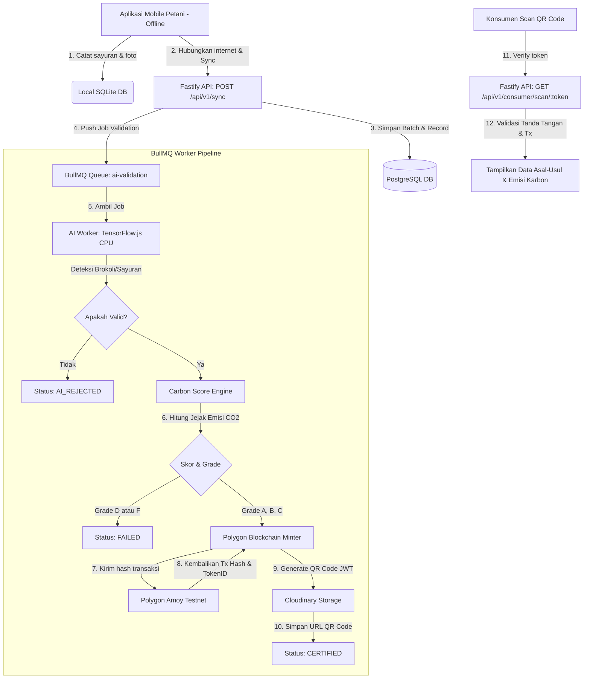

# 🌿 Tani Tinggi Backend

Tani Tinggi adalah platform sertifikasi sayuran dataran tinggi ramah lingkungan berbasis AI dan Blockchain. Sistem ini memungkinkan petani di daerah terpencil melakukan pencatatan data secara offline, menghitung jejak karbon produk secara otomatis, dan menerbitkan sertifikat QR-Code anti-tamper yang tersimpan di Polygon Blockchain untuk dibaca oleh konsumen akhir.

Repository ini berisi kode backend produksi berbasis **Fastify**, **TypeScript**, **Prisma (PostgreSQL)**, **BullMQ (Redis)** untuk antrean job AI/blockchain, dan **TensorFlow.js CPU** untuk klasifikasi gambar MobileNetV2 lokal.

---

## 🛠️ Tech Stack & Dependencies

| Komponen | Teknologi | Keterangan |
|---|---|---|
| **Core Framework** | Fastify (v4) | Performa tinggi, overhead rendah, mendukung type-safety Zod. |
| **Language** | TypeScript | Menjamin keamanan tipe data di seluruh modul backend. |
| **Database ORM** | Prisma | PostgreSQL ORM dengan auto-migration & type-safety. |
| **Job Queue** | BullMQ + Redis | Pengolahan antrean asynchronous (AI, Carbon, Blockchain). |
| **AI Engine** | TensorFlow.js CPU | Klasifikasi gambar daun/sayuran secara offline tanpa driver GPU. |
| **AI Model** | MobileNetV2 | Akurasi tinggi klasifikasi tumbuhan (~13MB download dari Google CDN). |
| **Blockchain** | Ethers.js (v6) | Interaksi smart-contract sertifikat NFT di Polygon Amoy. |
| **Storage** | Cloudinary | Cloud storage gratis untuk meng-host gambar sayuran & QR-code. |

---

## 📐 Arsitektur Sistem & Data Flow

Berikut adalah visualisasi alur data dari aplikasi offline petani hingga verifikasi blockchain konsumen menggunakan [Mermaid.js](https://mermaid.js.org/):



---

## 🚀 Panduan Setup Lokal

### 1. Prasyarat & Lingkungan
* Node.js versi `>= 20.0.0`
* PostgreSQL 15 / 16
* Redis Server v7
* *Atau gunakan Docker & Docker Compose untuk setup instan.*

### 2. Kloning & Install Dependensi
```bash
git clone https://github.com/your-username/tani-tinggi-backend.git
cd tani-tinggi-backend
npm install
```

### 3. Setup Konfigurasi Environment (`.env`)
Salin file contoh `.env` ke `.env` lalu sesuaikan kredensial Anda:
```bash
cp .env.example .env
```
*Pastikan `DATABASE_URL` dan `REDIS_URL` terkonfigurasi dengan benar.*

### 4. Buat JWT RSA Keys (Token Keamanan)
Sertifikat QR Code ditandatangani menggunakan kunci RS256:
```bash
npm run generate:keys
```
Perintah ini akan membuat folder `keys/` yang berisi `private.pem` dan `public.pem`.

### 5. Jalankan Migrasi Database & Seeding
```bash
# Sinkronisasi schema Prisma ke PostgreSQL
npx prisma migrate dev

# Isi database dengan data awal (Seeding)
npm run prisma:seed
```

### 6. Mulai Jalankan Layanan

**A. Jalankan API Server:**
```bash
npm run dev
# Server akan berjalan di http://localhost:3000
# Dokumentasi Swagger UI interaktif dapat diakses di http://localhost:3000/api/docs
```

**B. Jalankan Worker Antrean (Terminologi Terpisah):**
```bash
npm run dev:worker
# Worker akan terhubung ke Redis dan siap mengeksekusi job AI & Blockchain.
# Pada run pertama, worker akan mendownload MobileNetV2 (~13MB). Harap bersabar!
```

---

## 🔌 API Dokumentasi & Integrasi Axios

Seluruh API Response di Tani Tinggi mengikuti format standar JSON:
```json
{
  "success": true,
  "data": {},
  "meta": {
    "requestId": "uuid-request-id",
    "timestamp": "2026-06-20T09:00:00.000Z"
  }
}
```

Berikut adalah detail endpoint beserta contoh pemanggilannya menggunakan **Axios** di client (frontend):

### 🌐 Setup Axios Instance (Rekomendasi)
```javascript
import axios from 'axios';

const api = axios.create({
  baseURL: 'http://localhost:3000/api/v1',
  headers: {
    'Content-Type': 'application/json',
  },
});

// Interceptor untuk menyematkan JWT Token secara otomatis
api.interceptors.request.use((config) => {
  const token = localStorage.getItem('accessToken');
  if (token) {
    config.headers.Authorization = `Bearer ${token}`;
  }
  return config;
});
```

---

### 1.🔑 Modul Autentikasi (`/api/v1/auth`)

#### **A. Register Petani/Buyer (`POST /auth/register`)**
Mendaftarkan akun baru. Jika role adalah `FARMER`, maka data profil petani wajib disertakan.
*   **Request Body:**
    ```json
    {
      "email": "petani_daffa@gmail.com",
      "password": "Password123",
      "role": "FARMER",
      "fullName": "Daffa Aditya Pratama",
      "farmName": "Dieng Jaya Farm",
      "farmLocation": "Wonosobo, Jawa Tengah"
    }
    ```
*   **Axios Call:**
    ```javascript
    async function registerUser() {
      try {
        const response = await api.post('/auth/register', {
          email: 'petani_daffa@gmail.com',
          password: 'Password123', // Min 8 karakter, 1 huruf besar, 1 angka
          role: 'FARMER', // 'FARMER' atau 'BUYER'
          fullName: 'Daffa Aditya Pratama',
          farmName: 'Dieng Jaya Farm',
          farmLocation: 'Wonosobo, Jawa Tengah'
        });
        console.log('Register Berhasil:', response.data.data);
      } catch (error) {
        console.error('Register Gagal:', error.response.data.error);
      }
    }
    ```

#### **B. Login Akun (`POST /auth/login`)**
Melakukan login untuk mendapatkan `accessToken` (JWT) dan `refreshToken`.
*   **Request Body:**
    ```json
    {
      "email": "petani_daffa@gmail.com",
      "password": "Password123"
    }
    ```
*   **Axios Call:**
    ```javascript
    async function loginUser() {
      try {
        const response = await api.post('/auth/login', {
          email: 'petani_daffa@gmail.com',
          password: 'Password123'
        });
        
        const { accessToken, refreshToken } = response.data.data;
        // Simpan token ke storage
        localStorage.setItem('accessToken', accessToken);
        localStorage.setItem('refreshToken', refreshToken);
        
        console.log('Login Berhasil, Token disimpan!');
      } catch (error) {
        console.error('Login Gagal:', error.response.data.error);
      }
    }
    ```

#### **C. Refresh Token (`POST /auth/refresh`)**
Mendapatkan `accessToken` baru ketika token lama kedaluwarsa tanpa perlu login ulang.
*   **Request Body:**
    ```json
    {
      "refreshToken": "string-refresh-token-di-sini"
    }
    ```
*   **Axios Call:**
    ```javascript
    async function refreshAccessToken() {
      try {
        const localRefreshToken = localStorage.getItem('refreshToken');
        const response = await api.post('/auth/refresh', {
          refreshToken: localRefreshToken
        });
        
        const { accessToken, refreshToken } = response.data.data;
        localStorage.setItem('accessToken', accessToken);
        localStorage.setItem('refreshToken', refreshToken);
        
        console.log('Token Berhasil Di-refresh!');
      } catch (error) {
        console.error('Sesi berakhir, silakan login kembali.');
      }
    }
    ```

#### **D. Get Profile Saya (`GET /auth/me`)**
Mendapatkan profil pengguna aktif. Memerlukan autentikasi.
*   **Axios Call:**
    ```javascript
    async function getMyProfile() {
      try {
        const response = await api.get('/auth/me');
        console.log('Profil Saya:', response.data.data);
      } catch (error) {
        console.error('Akses ditolak:', error.response.data.error);
      }
    }
    ```

---

### 2. 🔄 Modul Sinkronisasi Petani (`/api/v1/sync`)
*Endpoint di modul ini membutuhkan autentikasi dengan role `FARMER`.*

#### **A. Sinkronisasi Batch Offline (`POST /sync`)**
Mengunggah data jejak pertanian dan pengiriman sayuran yang dicatat secara offline di perangkat mobile petani.
*   **Request Body:**
    ```json
    {
      "deviceId": "hp-android-daffa-123",
      "syncedAt": "2026-06-20T09:40:00.000Z",
      "records": [
        {
          "localId": "df67ef37-a4cb-4dd1-a4c4-c15321ef46d6",
          "vegetableType": "Brokoli",
          "vegetableWeight": 45.2,
          "fertilizerType": "ORGANIC_COMPOST",
          "pesticidesUsed": false,
          "imageUrl": "https://upload.wikimedia.org/wikipedia/commons/0/03/Broccoli_and_cross_section_edit.jpg",
          "imageHash": "hash-sha256-dari-gambar-lokal",
          "capturedAt": "2026-06-20T08:30:00.000Z",
          "delivery": {
            "distanceKm": 15,
            "vehicleType": "PICKUP_TRUCK",
            "destinationCity": "Jakarta"
          }
        }
      ]
    }
    ```
*   **Axios Call:**
    ```javascript
    async function syncOfflineData(batchPayload) {
      try {
        const response = await api.post('/sync', batchPayload);
        // Status code: 202 Accepted (karena proses AI & Blockchain dijalankan di background worker)
        console.log('Data diterima dan masuk antrean proses:', response.data.data);
      } catch (error) {
        console.error('Sinkronisasi gagal:', error.response.data.error);
      }
    }
    ```

#### **B. Cek Status Sync Batch (`GET /sync/status/:syncId`)**
Melihat status pemrosesan sinkronisasi batch (jumlah yang sukses, gagal, atau di-skip).
*   **Axios Call:**
    ```javascript
    async function checkSyncStatus(syncId) {
      try {
        const response = await api.get(`/sync/status/${syncId}`);
        console.log('Status Batch:', response.data.data);
        // data.status: 'PROCESSING' | 'COMPLETED' | 'PARTIAL' | 'FAILED'
      } catch (error) {
        console.error('Gagal memuat status batch:', error.response.data.error);
      }
    }
    ```

---

### 3. 📂 Modul Catatan Pertanian (`/api/v1/records`)
*Endpoint di modul ini membutuhkan autentikasi.*

#### **A. List Catatan Pertanian Saya (`GET /records`)**
Menampilkan daftar catatan pertanian milik petani yang sedang aktif dengan dukungan pagination dan filter.
*   **Query Parameters:**
    *   `limit`: Jumlah data per halaman (default: 10)
    *   `cursor`: ID record terakhir untuk pagination berbasis cursor
    *   `status`: Filter status (`PENDING`, `AI_VALIDATING`, `AI_REJECTED`, `CALCULATING`, `CERTIFYING`, `CERTIFIED`, `FAILED`)
    *   `grade`: Filter grade karbon (`A`, `B`, `C`, `D`, `F`)
    *   `startDate` / `endDate`: Rentang tanggal penambahan data
*   **Axios Call:**
    ```javascript
    async function getFarmRecords(filters = {}) {
      try {
        const response = await api.get('/records', {
          params: {
            limit: 10,
            status: 'CERTIFIED', // Opsional
            grade: 'A',          // Opsional
            ...filters
          }
        });
        console.log('Daftar Catatan:', response.data.data.data);
        console.log('Next Page Cursor:', response.data.data.nextCursor);
      } catch (error) {
        console.error('Gagal mengambil data:', error.response.data.error);
      }
    }
    ```

#### **B. Get Detail Catatan Pertanian (`GET /records/:id`)**
Mendapatkan detail record lengkap dengan riwayat AI Validasi, Emisi Karbon, Sertifikat, dan Detail Pengiriman.
*   **Axios Call:**
    ```javascript
    async function getSingleRecord(recordId) {
      try {
        const response = await api.get(`/records/${recordId}`);
        console.log('Detail Record:', response.data.data);
      } catch (error) {
        console.error('Record tidak ditemukan:', error.response.data.error);
      }
    }
    ```

#### **C. Hapus Catatan Pertanian (`DELETE /records/:id`)**
Menghapus record. Hanya diperbolehkan jika status record masih `PENDING` atau `FAILED`.
*   **Axios Call:**
    ```javascript
    async function deleteRecord(recordId) {
      try {
        const response = await api.delete(`/records/${recordId}`);
        console.log('Pesan:', response.data.message); // "Record deleted"
      } catch (error) {
        console.error('Gagal menghapus:', error.response.data.error);
      }
    }
    ```

---

### 4. 🔍 Modul Verifikasi Publik & Konsumen (`/api/v1/consumer`)
*Semua endpoint di modul ini bersifat PUBLIC (tidak memerlukan login).*

#### **A. Scan QR Code Sertifikat (`GET /consumer/scan/:qrToken`)**
Dipanggil ketika konsumen memindai QR Code sayuran. Endpoint ini akan mendecode JWT QR Token secara aman dan memverifikasi keabsahan data di blockchain.
*   **Axios Call:**
    ```javascript
    async function scanQrCodeSayur(qrToken) {
      try {
        const response = await api.get(`/consumer/scan/${qrToken}`);
        console.log('DATA TERVERIFIKASI (Tani Tinggi Origin):', response.data.data);
        /*
          Mengembalikan:
          - Detail Sayuran (Jenis, Berat)
          - Kredibilitas Petani (Nama Petani, Nama & Lokasi Kebun)
          - Nilai Ramah Lingkungan (EcoScore, EcoGrade, Jejak Karbon)
          - Bukti Imutabilitas Blockchain (TokenID, TxHash, ChainID)
        */
      } catch (error) {
        console.error('Sertifikat PALSU atau Kedaluwarsa!', error.response.data.error);
      }
    }
    ```

#### **B. Jelajahi Produk Tersertifikasi (`GET /consumer/products`)**
Menampilkan daftar sayuran yang telah tersertifikasi `CERTIFIED` di platform Tani Tinggi untuk dilihat oleh calon buyer/publik.
*   **Axios Call:**
    ```javascript
    async function getCertifiedProducts(limit = 10, cursor = '') {
      try {
        const response = await api.get('/consumer/products', {
          params: { limit, cursor }
        });
        console.log('Produk Tersertifikasi:', response.data.data.data);
      } catch (error) {
        console.error('Gagal mengambil data produk:', error.response.data.error);
      }
    }
    ```

---

### 5. 👑 Modul Administrator (`/api/v1/admin`)
*Endpoint di modul ini membutuhkan autentikasi dengan role `ADMIN`.*

#### **A. Statistik Platform (`GET /admin/stats`)**
Mendapatkan metrik agregat performa platform Tani Tinggi (total petani, total sertifikat, rata-rata eco-score platform, dll).
*   **Axios Call:**
    ```javascript
    async function getAdminStats() {
      try {
        const response = await api.get('/admin/stats');
        console.log('Metrik Tani Tinggi:', response.data.data);
      } catch (error) {
        console.error('Unauthorized:', error.response.data.error);
      }
    }
    ```

#### **B. Retry Pembuatan Sertifikat Gagal (`POST /certificate/retry/:recordId`)**
Memasukkan kembali record yang gagal diproses ke dalam antrean Blockchain Minting (misalnya karena gangguan jaringan blockchain/provider RPC).
*   **Axios Call:**
    ```javascript
    async function retryMinting(recordId) {
      try {
        const response = await api.post(`/certificate/retry/${recordId}`);
        console.log('Antrean blockchain dijalankan kembali:', response.data.success);
      } catch (error) {
        console.error('Gagal meretry minting:', error.response.data.error);
      }
    }
    ```

#### **C. Cek Kesehatan Antrean Antrean Pekerja (`GET /admin/queue/stats`)**
Melihat beban antrean BullMQ (jumlah job aktif, sedang menunggu, selesai, atau gagal).
*   **Axios Call:**
    ```javascript
    async function getQueueHealth() {
      try {
        const response = await api.get('/admin/queue/stats');
        console.log('Kesehatan Antrean BullMQ:', response.data.data);
      } catch (error) {
        console.error(error);
      }
    }
    ```

---

## 🔄 Pemrosesan Latar Belakang (BullMQ Pipeline)

Tani Tinggi memisahkan pemrosesan berat dari thread utama Fastify API ke dalam Worker terpisah agar API tetap responsif. Alur antrean adalah sebagai berikut:

1.  **`ai-validation` Queue:**
    *   Mengambil foto sayuran yang dikirim petani.
    *   Memproses gambar menggunakan TensorFlow.js MobileNetV2.
    *   Menghitung kecocokan sayuran yang diklaim (misal: "Brokoli") dengan objek hasil inferensi model AI.
    *   Jika akurasi di atas threshold (misal: `75%`), status diubah menjadi `CALCULATING` dan dilanjutkan ke antrean berikutnya.
2.  **`carbon-score` Queue:**
    *   Membaca metadata pengiriman (jarak kilometer, jenis kendaraan) dan pertanian (tipe pupuk, pestisida).
    *   Menghitung emisi gas rumah kaca berbasis rumus kalkulator karbon standard EPA.
    *   Menyimpan hasil kalkulasi dan menentukan Grade emisi. Jika Grade adalah A, B, atau C, status berubah menjadi `CERTIFYING`.
3.  **`blockchain-mint` Queue:**
    *   Membuat sidik jari data (*data hash* SHA-256) dari record pertanian untuk anti-tamper.
    *   Melakukan interaksi dengan Polygon Smart Contract (`mintCertificate`) menggunakan dompet admin platform.
    *   Membuat payload token QR Code, menandatanganinya dengan RSA Private Key (pembuatan JWT token lokal).
    *   Mengunggah gambar QR Code ke Cloudinary.
    *   Menyimpan informasi transaksi (Tx Hash, Token ID) ke tabel `Certificate`, mengubah status sayuran menjadi `CERTIFIED`.

---

## 📝 Lisensi
Proyek ini dilisensikan di bawah Lisensi MIT.
